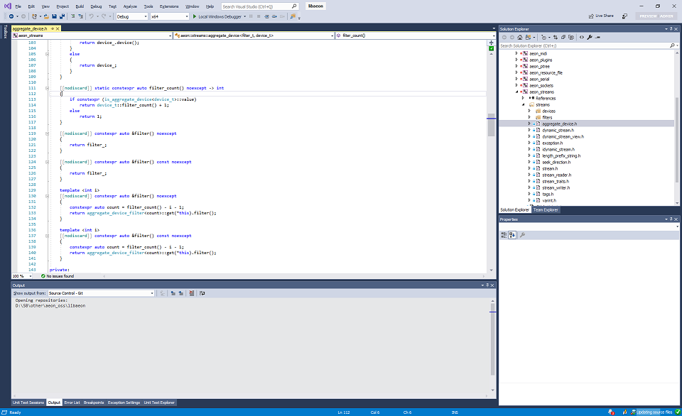

Visual Studio 2019 - Original Blue Theme from Visual Studio 2017
==============

This repository aims to make VS2019 look like VS2017 (Blue theme) as much as
possible. The original theme was exported and reimported into VS2019, and then
manually tweaked to fix all remaining issues.

In order to use this theme, install the [Color Theme Editor](https://marketplace.visualstudio.com/items?itemName=VisualStudioPlatformTeam.VisualStudio2019ColorThemeEditor) plugin.

Note: You may have to restart Visual Studio once after importing the theme as it sometimes doesn't apply the first time (perhaps a bug in the theme editor?)

